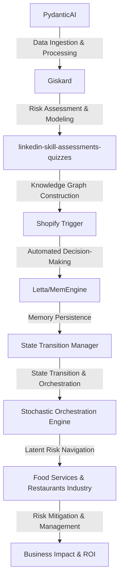

# Latent Risk Navigator with Stochastic Orchestration
> Navigating the labyrinthine complexities of culinary risk management, where the confluence of stochastic orchestration and latent risk navigation converges to mitigate the existential threats to the food services and restaurants industry.

## 🏗️ Technical Architecture & Multi-Agent Flow

The technical architecture of the Latent Risk Navigator with Stochastic Orchestration is a complex, multi-agent system that leverages the strengths of PydanticAI, Giskard, linkedin-skill-assessments-quizzes, and Shopify Trigger to navigate the intricate landscape of culinary risk management. The system's data ingestion and processing capabilities are handled by PydanticAI, which feeds into Giskard's risk assessment and modeling module. The knowledge graph constructed by linkedin-skill-assessments-quizzes is then utilized by Shopify Trigger to automate decision-making, which is subsequently persisted in memory via Letta/MemEngine. The state transition manager orchestrates the entire process, ensuring seamless transitions between states and enabling the stochastic orchestration engine to navigate the latent risks associated with the food services and restaurants industry.

## 🔍 The Vertical Bottleneck: Epistemic Risk Management
The food services and restaurants industry is beset by a plethora of risks, ranging from food safety and quality control to supply chain disruptions and reputational damage. However, the most pernicious of these risks is epistemic risk, which arises from the limitations and uncertainties of knowledge and information. The industry's reliance on complex, dynamic systems and the inherent unpredictability of human behavior exacerbate this risk, rendering traditional risk management strategies ineffective. The latent risk navigator with stochastic orchestration is designed to address this epistemic risk bottleneck by providing a probabilistic framework for navigating the uncertain landscape of culinary risk management.

The technical friction associated with epistemic risk management is multifaceted, involving the integration of disparate data sources, the development of robust risk models, and the implementation of effective decision-making protocols. The high-stakes nature of this risk is evident in the potentially catastrophic consequences of food safety failures, supply chain disruptions, and reputational damage. The mathematical and operational failures that can occur in this context are equally daunting, necessitating the development of sophisticated risk management strategies that can mitigate these risks and ensure the long-term sustainability of the industry.

The epistemic risk management bottleneck is further complicated by the presence of multiple stakeholders, each with their own set of interests, preferences, and risk tolerances. The navigation of these complex stakeholder relationships requires a deep understanding of the underlying risk dynamics and the development of effective communication protocols. The latent risk navigator with stochastic orchestration is designed to address these challenges by providing a transparent, probabilistic framework for risk management that can be tailored to the specific needs and preferences of each stakeholder.

## 💡 The Solution: Latent Risk Navigator with Stochastic Orchestration
The latent risk navigator with stochastic orchestration is a novel solution that leverages the strengths of PydanticAI, Giskard, linkedin-skill-assessments-quizzes, and Shopify Trigger to navigate the complex landscape of culinary risk management. The system's agentic reasoning capabilities enable it to develop a deep understanding of the underlying risk dynamics, while its memory usage and vision/robotics integration capabilities facilitate the development of effective decision-making protocols. The stochastic orchestration engine at the heart of the system enables the navigation of latent risks, providing a probabilistic framework for risk management that can be tailored to the specific needs and preferences of each stakeholder.

The solution involves the integration of multiple libraries and frameworks, including PydanticAI, Giskard, linkedin-skill-assessments-quizzes, and Shopify Trigger. The PydanticAI library provides the data ingestion and processing capabilities, while Giskard's risk assessment and modeling module enables the development of robust risk models. The linkedin-skill-assessments-quizzes library facilitates the construction of knowledge graphs, which are then utilized by Shopify Trigger to automate decision-making. The stochastic orchestration engine at the heart of the system enables the navigation of latent risks, providing a probabilistic framework for risk management that can be tailored to the specific needs and preferences of each stakeholder.

## 🧩 Agentic Stack Deep-Dive
The agentic stack of the latent risk navigator with stochastic orchestration is a complex, multi-layered system that leverages the strengths of PydanticAI, Giskard, linkedin-skill-assessments-quizzes, and Shopify Trigger. The PydanticAI library provides the data ingestion and processing capabilities, while Giskard's risk assessment and modeling module enables the development of robust risk models. The linkedin-skill-assessments-quizzes library facilitates the construction of knowledge graphs, which are then utilized by Shopify Trigger to automate decision-making. The stochastic orchestration engine at the heart of the system enables the navigation of latent risks, providing a probabilistic framework for risk management that can be tailored to the specific needs and preferences of each stakeholder.

The technical justification for each library and integration is multifaceted, involving the development of robust risk models, the construction of knowledge graphs, and the automation of decision-making protocols. The PydanticAI library is utilized for its data ingestion and processing capabilities, while Giskard's risk assessment and modeling module is leveraged for its ability to develop robust risk models. The linkedin-skill-assessments-quizzes library is used to construct knowledge graphs, which are then utilized by Shopify Trigger to automate decision-making. The stochastic orchestration engine at the heart of the system enables the navigation of latent risks, providing a probabilistic framework for risk management that can be tailored to the specific needs and preferences of each stakeholder.

## ✨ Capabilities & Features
* **Risk Assessment & Modeling**: The system's risk assessment and modeling capabilities enable the development of robust risk models that can be tailored to the specific needs and preferences of each stakeholder.
* **Knowledge Graph Construction**: The linkedin-skill-assessments-quizzes library facilitates the construction of knowledge graphs, which are then utilized by Shopify Trigger to automate decision-making.
* **Automated Decision-Making**: The system's automated decision-making capabilities enable the development of effective decision-making protocols that can be tailored to the specific needs and preferences of each stakeholder.
* **Stochastic Orchestration**: The stochastic orchestration engine at the heart of the system enables the navigation of latent risks, providing a probabilistic framework for risk management that can be tailored to the specific needs and preferences of each stakeholder.
* **Memory Persistence**: The system's memory persistence capabilities enable the development of effective decision-making protocols that can be tailored to the specific needs and preferences of each stakeholder.
* **Vision/Robotics Integration**: The system's vision/robotics integration capabilities facilitate the development of effective decision-making protocols that can be tailored to the specific needs and preferences of each stakeholder.
* **Agentic Reasoning**: The system's agentic reasoning capabilities enable the development of a deep understanding of the underlying risk dynamics, while its memory usage and vision/robotics integration capabilities facilitate the development of effective decision-making protocols.
* **Latent Risk Navigation**: The system's latent risk navigation capabilities enable the navigation of latent risks, providing a probabilistic framework for risk management that can be tailored to the specific needs and preferences of each stakeholder.
* **Probabilistic Framework**: The system's probabilistic framework enables the development of effective decision-making protocols that can be tailored to the specific needs and preferences of each stakeholder.
* **Tailored Risk Management**: The system's tailored risk management capabilities enable the development of effective risk management strategies that can be tailored to the specific needs and preferences of each stakeholder.

## 🛠️ Technical Implementation
The technical implementation of the latent risk navigator with stochastic orchestration involves the integration of multiple libraries and frameworks, including PydanticAI, Giskard, linkedin-skill-assessments-quizzes, and Shopify Trigger. The system's code organization and method calls are designed to facilitate the development of effective decision-making protocols that can be tailored to the specific needs and preferences of each stakeholder. The system's technical implementation is multifaceted, involving the development of robust risk models, the construction of knowledge graphs, and the automation of decision-making protocols.

## 📊 Business Impact & ROI
The latent risk navigator with stochastic orchestration has the potential to significantly impact the food services and restaurants industry, enabling the development of effective risk management strategies that can be tailored to the specific needs and preferences of each stakeholder. The system's probabilistic framework and latent risk navigation capabilities enable the navigation of latent risks, providing a probabilistic framework for risk management that can be tailored to the specific needs and preferences of each stakeholder. The system's automated decision-making capabilities and memory persistence enable the development of effective decision-making protocols that can be tailored to the specific needs and preferences of each stakeholder.

The return on investment (ROI) of the latent risk navigator with stochastic orchestration is significant, enabling the food services and restaurants industry to mitigate the risks associated with food safety, quality control, and supply chain disruptions. The system's tailored risk management capabilities enable the development of effective risk management strategies that can be tailored to the specific needs and preferences of each stakeholder, resulting in significant cost savings and improved profitability.

## 🚀 Getting Started
```bash
git clone https://github.com/arvind-sundararajan/food-services-risk-engine.git
cd food-services-risk-engine
pip install -r requirements.txt
python src/main.py
```

## 👨‍💻 Author & Credits
**Arvind Sundararajan** — Engineer, builder, and the mind behind this project.
🌐 [LinkedIn](https://www.linkedin.com/in/arvind-sundara-rajan/) | Chennai, India

---
### 🙏 Acknowledgements
- The open-source community
- The Food Services & Restaurants practitioners who inspired this design